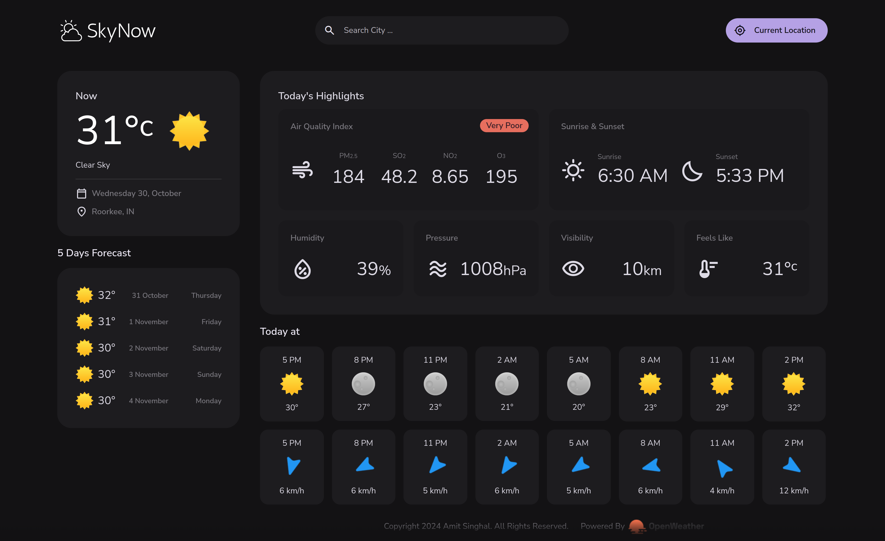

<p align="center"></p>
<p align="center"></p>
<h3 align="center">Get Live Weather Updates | Real-Time OpenWeather App</h3>
<hr>

<div align="center">


<a href="https://singhal-amit.github.io/Sky-Now/" target="_blank">
    
</a>
</div>

<br/>
Sky Now is a web application that provides real-time weather updates based on your current location. It gives you detailed weather information including temperature, humidity, wind speed, and more.

## 📸 Live Preview
<p align="center">
 
</p>

<details>
     <summary>Table of Contents</summary>
     
- [Getting Started](#getting-started)
- [Usage](#usage)
- [Features](#features)
- [Built With](#built-with)
- [Contribution](#contribution)
- [Connect with Me](#connect-with-me)
- [License](#license)

</details>

## 🚀 Getting Started

To run this project locally, follow these steps:

1. **Clone the repository**

   ```sh
   git clone https://github.com/singhal-amit/Sky-Now.git
   ```

2. **Set Up the Project**
   - Ensure you have a modern web browser installed
   - You can open the `index.html` file directly or use a local server
   - Recommended: Use [Live Server](https://marketplace.visualstudio.com/items?itemName=ritwickdey.LiveServer) extension in VSCode for a smooth development experience

3. **API Configuration**
   - This project uses OpenWeather API
   - Obtain an API key from [OpenWeatherMap](https://openweathermap.org/api)
   - Replace the placeholder API key in the project's JavaScript file with your own key

## 🎮 Usage

1. **Grant location permission**
     - Open the application
     - Allow access to your device's location when prompted

2. **View current weather**
     - After granting permission, see real-time weather for your location
     - Includes temperature, humidity, wind speed, and more

3. **Search for locations**
    - Enter a city or location name in the search bar
    - Press Enter to fetch weather information for that location

## ✨ Features

- 🌍 Real-time weather updates
- 🎨 User-friendly interface
- 📊 Detailed weather information
- 🌡️ Multiple weather parameters (temperature, humidity, wind speed, etc.)
- 📍 Easy location-based weather access

## 🛠️ Built With

<div style="display: flex; flex-wrap: wrap; gap: 5px;">
     <a href="https://html.com/"></a>
     <a href="https://www.w3.org/Style/CSS/"></a>
     <a href="https://developer.mozilla.org/en-US/docs/Web/JavaScript"></a>
     <a href="https://openweathermap.org/api"></a>
</div>

### Thanks to all Stargazers ⭐️

<a href="https://star-history.com/#singhal-amit/Sky-Now&Timeline">
 <picture>
   <source media="(prefers-color-scheme: dark)" srcset="https://api.star-history.com/svg?repos=singhal-amit/Sky-Now&theme=dark" />
   <source media="(prefers-color-scheme: light)" srcset="https://api.star-history.com/svg?repos=singhal-amit/Sky-Now" />
   
 </picture>
</a>

## 🤗 Contribution

Contributions are welcome! Here's how you can help:

1. Fork the repository
2. Create a feature branch (`git checkout -b feature/YourFeature`)
3. Commit changes (`git commit -am 'Add some feature'`)
4. Push to branch (`git push origin feature/YourFeature`)
5. Create a Pull Request

## 🌐 Connect with Me

<table>
    <tr>
        <td>
            <a href="https://github.com/singhal-amit">
                
            </a>
        </td>
        <td>
            <a href="https://www.linkedin.com/in/singhal-amit/">
                
            </a>
        </td>
        <td>
            <a href="https://www.instagram.com/_singhal_amit/" target="blank"></a>
        </td>
        <td>
            <a href="mailto:rakshit.singhal712@gmail.com">
                
            </a>
        </td>
    </tr>
</table>

## 📄 License

This project is licensed under the MIT License. See the [LICENSE](LICENSE) file for details.
